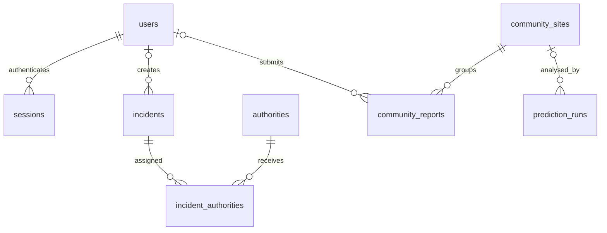

# EcoWatch database

## Overview

EcoWatch now uses a persistent **SQLite relational database**, accessed by the Express backend through Node's built-in `node:sqlite` module. The default file is `EcoWatch/backend/data/ecowatch.sqlite`. It is created and migrated before the API starts accepting requests. It survives browser refreshes, sign-out and backend restarts.

Users, login sessions, authorities, incidents, incident/authority assignments, community sites, individual community reports and prediction runs are stored in the database. Existing REST response shapes are preserved. Printable incident reports and dashboard statistics are generated from persisted incidents; they do not need duplicate storage tables. Community report clusters and corroboration values are calculated from their underlying observations.

Browser storage only holds the current bearer token/profile and the device's theme preference. It is not the source of truth for accounts or application records. Map selection, loading state and unsent form input remain temporary UI state. Reference GeoJSON, images, model weights and fetched imagery remain files or external model-service resources. Generated PDF files are produced on demand rather than archived.

## Requirements and setup

Use Node.js **22.12.0 or newer**. The npm scripts include `--experimental-sqlite` because the installed Node 22.12 runtime requires it. That runtime emits an experimental API warning. No database server or additional npm database driver is required. See the [Node 22.12 SQLite API documentation](https://nodejs.org/download/release/v22.12.0/docs/api/sqlite.html).

From the application directory:

```bash
cd backend
npm install
cp .env.example .env
npm run db:init
npm run db:check
npm run dev
```

`npm start` also initializes the database automatically. The explicit `db:init` command is useful before deployment. Start the frontend with its existing `npm run dev` command, and the Python model service using its own README. The API defaults to port 5050; the model API defaults to port 8000.

| Environment variable | Meaning |
| --- | --- |
| `DATABASE_PATH` | Optional database filename. Absolute paths are recommended. Relative overrides resolve against the process working directory. The default resolves against the backend directory, regardless of working directory. |
| `LEGACY_DATA_DIR` | Directory containing JSON files to import on first initialization. Defaults to `backend/data`. |
| `SEED_DEMO_DATA` | `true` seeds demo accounts and incidents; `false` skips them. Defaults to enabled outside production and disabled when `NODE_ENV=production`. Only applies on first initialization. |
| `NODE_ENV` | Set `production` for production deployments. |
| `PORT`, `CLIENT_ORIGIN`, `MODEL_API_URL` | Existing API, frontend-origin and model-service settings. |

Development initialization preserves the existing demo logins: `admin@ecowatch.local` / `admin123` and `authority@ecowatch.local` / `authority123`. Their database passwords are hashed. Do not use these published credentials for a deployed database. Setting `SEED_DEMO_DATA=false` later does **not** remove already imported accounts or incidents.

For a fresh production database, set `NODE_ENV=production`, `SEED_DEMO_DATA=false`, an absolute persistent `DATABASE_PATH`, and `LEGACY_DATA_DIR` pointing to an empty directory if you do not want historical local reports imported. Create the directory before starting. Authority reference names are seeded even without demo data.

To provision an admin or authority, set `ACCOUNT_EMAIL`, `ACCOUNT_NAME`, `ACCOUNT_PASSWORD` (at least eight characters), and `ACCOUNT_ROLE` (`admin`, `authority`, or `community`) in the backend's untracked `.env`, then run:

```bash
npm run db:user
```

Remove the temporary `ACCOUNT_*` settings afterwards. This command creates accounts; it does not silently replace existing users. Public registration always creates a community account. Existing `AUTH_SECRET` settings are no longer used: sessions now use random opaque tokens rather than signed demo tokens.

## Schema and data dictionary

The exact executable schema is `backend/src/database/migrations/001_initial.sql`. Tables use SQLite `STRICT` typing. IDs are text UUIDs except the existing numeric incident and authority IDs. Legacy user IDs are converted to text. Dates/timestamps are stored as text; newly generated event timestamps use UTC ISO 8601, and session expiry uses epoch milliseconds.

| Table/view | Columns and purpose |
| --- | --- |
| `schema_migrations` | `version TEXT PK`, `applied_at TEXT NOT NULL`. Tracks SQL migrations and the one-time legacy import. |
| `users` | `id TEXT PK`, `name TEXT NOT NULL`, `email TEXT UNIQUE COLLATE NOCASE` (nullable for unidentified legacy reporters), `password_hash TEXT` (nullable only for imported placeholders), `role TEXT NOT NULL`, `disabled INTEGER NOT NULL DEFAULT 0`, `created_at TEXT NOT NULL` (UTC default). Roles are constrained to admin/authority/community; disabled is 0/1. |
| `sessions` | `token_hash TEXT PK`, `user_id TEXT NOT NULL FK`, `expires_at INTEGER NOT NULL`. Only SHA-256 digests of bearer tokens are stored. |
| `authorities` | `id INTEGER PK`, `name TEXT NOT NULL UNIQUE`. Reference organizations available for incident assignment. |
| `incidents` | `id INTEGER PK AUTOINCREMENT`, `type TEXT`, `lat REAL`, `lng REAL`, `severity TEXT`, `hectares REAL`, `confidence REAL`, `date TEXT`, `time TEXT`, `resolved TEXT`, `status TEXT`, `color TEXT`, `notes TEXT`, `recommendation TEXT`, `created_by TEXT FK`. Only `resolved` and `created_by` are nullable. Coordinates have geographic range checks; hectares must be nonnegative; confidence is 0–100. Severity is low/medium/high/critical; status is Monitoring/Reported/Escalated/Resolved. |
| `incident_authorities` | `incident_id INTEGER FK`, `authority_id INTEGER FK`; both NOT NULL, composite primary key. One row per incident/organization assignment. |
| `community_sites` | `id TEXT PK`. Stable identity of a report cluster; aggregate values are not stored here. |
| `community_reports` | `id TEXT PK`, `site_id TEXT NOT NULL FK`, `reporter_id TEXT FK` (nullable for anonymous legacy reports), `latitude REAL NOT NULL`, `longitude REAL NOT NULL`, `accuracy REAL` (nullable, nonnegative metres), `notes TEXT` (nullable), `reported_at TEXT NOT NULL`. Unique `(site_id, reporter_id)` prevents repeated contributions from one identified user. Coordinates are constrained to valid ranges. |
| `prediction_runs` | `id TEXT PK`, `site_id TEXT FK` (nullable), `analysed_at TEXT`, `source TEXT`, `latitude REAL`, `longitude REAL`, `date_start TEXT`, `date_end TEXT`, `mining_detected INTEGER`, `detection_level TEXT`, `mean_probability REAL`, `mining_fraction REAL`, `affected_area_m2 REAL`, `largest_component_pixels INTEGER`, `threshold REAL`, `model_version TEXT`, `result_json TEXT`. All except `site_id`, date bounds and `result_json` are NOT NULL. Coordinates and the boolean detection field have checks. Result JSON must be valid when supplied. |
| `community_site_summary` (view) | Groups reports by `site_id`, returning `id`, average `latitude`/`longitude`, `reportCount`, earliest `firstReportedAt` and latest `lastReportedAt`. |

Incident `type` is deliberately free text to preserve the API's extensibility. Incident date/time fields preserve the existing API and seed format; there is no timezone column or database calendar-format constraint. Prediction metrics preserve model-service output; the database does not enforce model-specific probability thresholds beyond the boolean/coordinate checks.

## Relationships



- A user can have multiple sessions, authored incidents and community reports.
- Incidents and authorities have a many-to-many relationship through `incident_authorities`.
- A site has multiple reports. A known user can contribute only once to a particular site.
- A site can have multiple prediction runs; map predictions have no site foreign key. The latest site prediction is selected by analysis timestamp, with insertion order as a tie-breaker.
- There is currently no account-to-authority-organization mapping: the `authority` role gives the same permissions as the prior application. Assignments reference organizations, not individual authority accounts.
- Community sites and detected incidents remain separate concepts, matching the existing workflows. Submitting a community observation does not automatically create an incident.

Foreign keys are enabled on every connection. Deleting a user cascades their sessions, sets incident creator references to NULL, and is blocked while community reports still reference them. Deleting an incident removes its assignments; deleting an assigned authority is blocked. Deleting a site cascades its reports and sets its prediction references to NULL, preserving analysis history. The application currently exposes no deletion endpoints; these rules also protect administrative SQL operations.

## Normalization

The core relational entities follow third normal form:

1. **First normal form:** each entity has a primary key and scalar relational fields. Nested report arrays became `community_reports` rows; authority lists became junction rows. Coordinates are numeric columns rather than only display strings.
2. **Second normal form:** the assignment table's composite key identifies the complete relationship. Organization names live in `authorities`, not beside every assignment. All other domain tables use single-column keys.
3. **Third normal form:** credentials and identity belong to users; observations refer to users by ID; site identity is separate from observations; model-run facts belong to prediction runs. User and authority descriptions are not duplicated across reports.

Derived values are intentionally computed: cluster centroid/count/date range use a SQL view; corroboration uses report count; coordinate labels are formatted by the service; printable incident reports and statistics use incident records. This avoids inconsistent copies after updates.

`prediction_runs.result_json` is an intentional exception to fully decomposing model output. It preserves the complete model response, including raster mask arrays and variable metadata, as a validated JSON document. Frequently used metrics are also stored in typed columns for history queries. Both are written in the same INSERT. This is deliberate denormalization for output fidelity; manually editing only one representation can make them disagree. Generated reports reflect current incident values and are **not immutable historical snapshots**.

## Migration and existing data

Startup applies sorted `.sql` migration files once, each inside `BEGIN IMMEDIATE` / COMMIT. The migration marker is committed with the schema change. Add a new numbered SQL file for future schema changes; do not edit an already-applied migration and expect existing databases to change.

The one-time `legacy-import-v1` step imports:

- Demo users/incidents when demo seeding is enabled, and the authority reference list.
- `community-users.json`, preserving existing salted password hashes.
- `community-reports.json`, splitting sites, observations and latest prediction documents into related records.
- `prediction-history.json`, preserving every available run.

Missing JSON files are treated as empty. Invalid JSON or conflicting/invalid records fail the import and roll it back; no records are silently discarded. Original files are never overwritten or deleted. Restarting does not reimport records after the marker exists, and later edits to JSON files have no effect on the database. Files restored later need a deliberate migration; do not remove the import marker from a populated database.

Anonymous historical reports retain a NULL reporter reference. A historical reporter ID missing its account receives a disabled placeholder with no email or password, preserving referential integrity without creating a usable login. NULL reporter references permit multiple historical anonymous reports at one site; new submissions always require authentication. Legacy site predictions are imported as `legacy-site` runs; old history rows remain independent because there is no reliable original linkage for deduplication.

Memory-only incidents created before this implementation cannot be recovered after their old server exits. Legacy signed tokens are intentionally invalid; users must sign in once after the upgrade. New database sessions survive subsequent restarts.

## Runtime behavior and API

Existing `/api/auth/login`, `/api/auth/register`, `/api/incidents`, `/api/reports`, `/api/authorities`, `/api/stats`, `/api/community-reports` and `/api/predictions/history` routes now use persisted records, directly or through derived services.

`GET /api/auth/me` returns the currently authenticated profile. `POST /api/auth/logout` revokes the bearer token and returns 204. The frontend sign-out flow calls logout before clearing browser credentials and reports failures. Sessions expire after eight hours; expired rows are cleaned up on subsequent login/registration. Every protected request reloads the user's current role and disabled state from the database. Passwords use salted scrypt hashes; random session tokens are returned only to clients.

Incident writes require the admin or authority role; registration cannot choose a privileged role. New incident creator IDs are persisted. Unknown authority assignments are rejected, and the complete incident/assignment transaction rolls back. Report lookup and PDFs use incident IDs; an empty latest-report collection returns 404.

Community submission validates coordinate ranges, accuracy and notes (maximum 5,000 characters). Clustering keeps the existing 250-metre Haversine rule. The first qualifying cluster in stable creation order receives the report. `BEGIN IMMEDIATE` serializes the lookup and insertion so concurrent writes cannot bypass duplicate checks. The centroid is recomputed from observations. Corroboration remains a report-agreement heuristic, not a probability of illegal mining.

The report is committed before calling the model service. If inference fails, the saved submission remains available and the API returns `predictionError`; it does not lose the observation. Successful site inference creates one linked history record containing the full result. Coordinates stored with that run are the coordinates actually submitted to inference, even if more reports arrive while it is running. Prediction history no longer deletes older records at the previous 1,000-run limit.

## Transactions, indexes and operational limits

All queries with external values use prepared statements. SQLite uses WAL journaling, foreign-key enforcement, FULL synchronous durability and a five-second busy timeout. Account email uniqueness and one-report-per-user/site uniqueness are enforced by the database, not just JavaScript.

Indexes support session user/expiry lookup, chronological incidents, authority assignment lookup, community reporter lookup, chronological prediction history and latest predictions by site. Primary/unique keys additionally index identities, user emails, authority names and site/reporter pairs.

This implementation targets a single backend installation on durable local storage. SQLite permits one writer at a time, and the Node adapter is synchronous. Large inference documents, unpaginated history responses and scanning cluster centroids will eventually need pagination, spatial indexing or a server database such as PostgreSQL/PostGIS. Do not place this database on ephemeral deployment storage or share its file across separate hosts. Multiple replicas require an intentional database architecture change. There is no automated retention policy, scheduled backup, password reset or email verification added by this integration.

## Backup, restore and inspection

Create a consistent backup, including committed data currently in WAL, while the API is running:

```bash
npm run db:backup -- /absolute/path/new-backup.sqlite
npm run db:check
npm test
```

The backup destination must not already exist and its parent directory must exist. `VACUUM INTO` produces a standalone SQLite file. Do not copy only the main database file while writers are active: the `-wal` file may contain committed data.

For restore, stop every API process using the database, preserve the existing database and its `-wal`/`-shm` files together, then place the backup at `DATABASE_PATH` without stale sidecar files at that path. Run `db:check` and restart the API. Test restores periodically. Database files contain personal data and credential hashes; restrict filesystem access and protect backups. SQLite does not add application-level encryption here. Database and sidecar files at the default location are gitignored; custom paths need their own ignore/access controls.

Open the file with a SQLite client, or use `db:check` for integrity and relationship checks. Useful read-only queries:

```sql
SELECT version, applied_at FROM schema_migrations ORDER BY applied_at;
SELECT role, count(*) FROM users GROUP BY role;
SELECT * FROM community_site_summary ORDER BY lastReportedAt DESC;
SELECT source, count(*) FROM prediction_runs GROUP BY source;
PRAGMA foreign_key_check;
PRAGMA integrity_check;
```

## Verification

`backend/test/database.test.js` starts a real API against an isolated temporary SQLite database and a local model stub. It checks account registration/login, duplicate emails, role restrictions, incident creation/status/assignment rollback, community clustering/duplicate rejection, validation, prediction persistence, API restart, report/PDF/statistics consistency, session revocation, legacy orphan preservation, repeat-start import idempotence, foreign-key enforcement and a consistent live backup.

The stub makes database tests reproducible without satellite-service credentials. It does not verify live model accuracy or external imagery availability. The application's actual database can be checked independently with `npm run db:check`.
